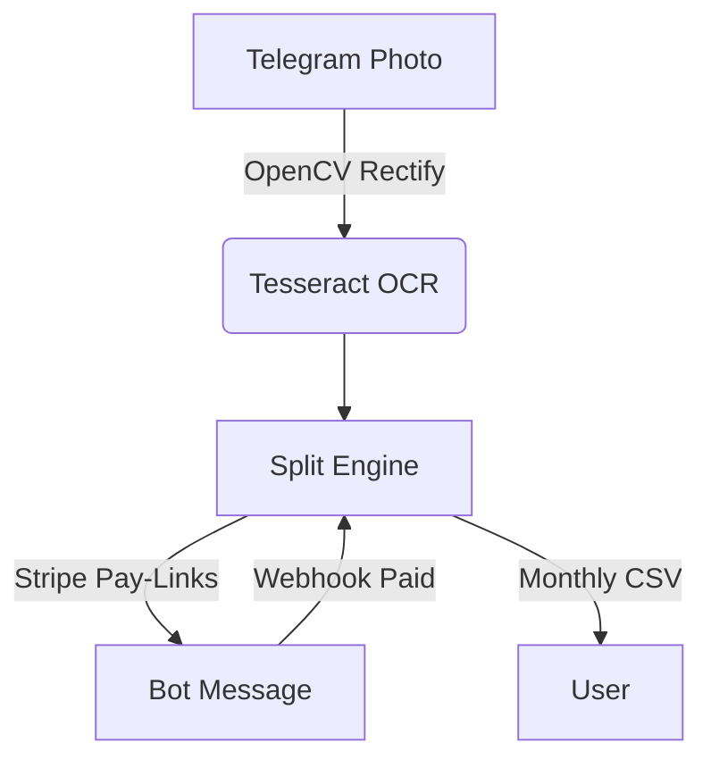

# 🧾 SmartSplit – Household Bill‑Sharing Bot

## 📌 Project Status
**Stage:** Prototype  
The codebase delivers a minimal end‑to‑end flow: you can send a receipt photo to the Telegram bot, it parses the total with Tesseract, splits the cost equally across two hard‑coded members, and returns placeholder pay‑links. From here we will iterate toward Alpha (custom splits, CSV export) and beyond.

---

## ✨ MVP Features

| Capability | Description |
|------------|-------------|
| Telegram Bot | `/start`, `/receipt`, `/monthlycsv` commands scaffolded. |
| OCR Parsing | Tesseract‑based total extraction (regex heuristic). |
| Cost Splitter | Even split across household or custom percentages (coming next). |
| Fake Pay‑Links | Placeholder links for demos / Stripe sandbox integration. |
| CSV Export | Command will export a monthly ledger (stub in prototype). |
| CI / CD | GitHub Actions lints, tests & builds Docker images; auto‑deploys to Fly.io. |

---

## 🛠️ Tech Stack

* **python‑telegram‑bot v21** – Async, feature‑rich Telegram SDK  
* **FastAPI** – Lightweight REST & webhook endpoints  
* **PostgreSQL** + **SQLAlchemy** – Relational data with Alembic migrations  
* **Celery** + **Redis** – Background OCR & payment‑webhook workers  
* **Tesseract‑OCR** (`pytesseract`) – Baseline text extraction
* **OpenCV preprocessing** – auto‑crop, de‑skew, illumination fix  
* **Docker‑Compose** – Local dev & prod parity  

### Planned Enhancements 
* Donut / LayoutLMv3 deep OCR models for structured JSON output  
* YOLOv8 detector for robust **TOTAL** amount localisation  
* Analytics dashboard (React + Recharts) & smart split predictions  

---

## 📦 Quick Start

```bash
# 1. Clone & enter
git clone https://github.com/YOUR_GH_USERNAME/smartsplit.git
cd smartsplit

# 2. Copy example env and fill secrets
cp .env.example .env            # TELEGRAM_TOKEN, STRIPE_API_KEY, DB creds

# 3. Fire it up 🚀
docker compose up --build
```

> Open `http://localhost:8000/docs` for the interactive FastAPI docs.

### Local Dev (no Docker)

```bash
python -m venv .venv && source .venv/bin/activate
pip install -r requirements/dev.txt
export TELEGRAM_TOKEN=xxxxx  # etc.
python bot/main.py
```

---

## 🖼️ System Architecture



---

## 🧪 Tests

```bash
pytest -q
```

Unit tests cover:
* `extract_total()` regex correctness
* Split math edge‑cases (rounding, unequal percentages)

---

## 🌍 Deployment

### Fly.io (default)

```bash
fly launch            # first‑time only
fly deploy            # pushes latest image from GH Action
```

### Render / Heroku / K8s

Container‑native; provide `DATABASE_URL`, `REDIS_URL`, `TELEGRAM_TOKEN`, `STRIPE_API_KEY`.

---

## 🗺️ Roadmap

| Milestone | Key Goals |
|-----------|-----------|
| **Prototype** | End‑to‑end happy path with fake pay‑links |
| **MVP** | Custom % splits, CSV export, production deploy |
| **Sprint 1** | OpenCV preprocessor, UX polish |
| **Sprint 2** | Deep‑OCR (Donut), expense categorisation, `/stats` charts |
| **v1.0** | Smart split predictor, fraud detection, full dashboard UI |

---

## 🤝 Contributing

PRs welcome! Please follow conventional commits and run `ruff --fix .` before pushing.

1. Fork → feature branch `feature/xyz`  
2. `make pre‑commit`  
3. Ensure `pytest` and `docker compose up` are green  
4. Open PR with screenshot / Loom demo  

---

## 📄 License

[MIT](LICENSE) © 2025 

---

## 🙏 Acknowledgements

* [python‑telegram‑bot](https://github.com/python-telegram-bot/python-telegram-bot)  
* [Tesseract OCR](https://github.com/tesseract-ocr/tesseract)  
* [Hugging Face Donut](https://huggingface.co/docs/transformers/model_doc/donut)  
* [Fly.io](https://fly.io) free tier credits
